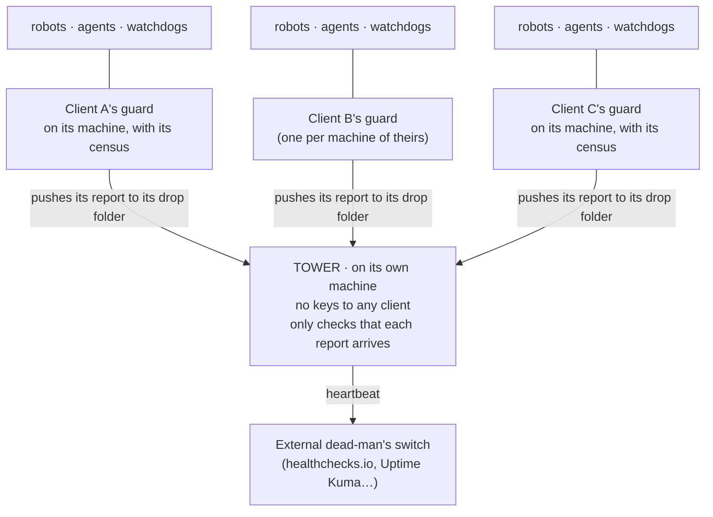

# Control Tower - Multi-agent Monitoring

**Your robots die in silence. And if you sell automation maintenance to several clients, you'll be
the last to find out.** This is a control tower for agents, robots and watchdogs: a census of
everything you have scheduled, one guard per client that checks what each robot *produced* (not that
it "ran"), a separate tower that watches the guards, and a hook for Claude Code that stops your agent
when something scheduled shows up that nobody has registered. Just Python 3 (tested on 3.9, 3.12 and
3.14).

[](https://github.com/DEscalanteZ/torre-de-control-vigilancia-multiagente-es/actions/workflows/pruebas.yml)

> **Version 0.1.** It works and it's tested (see [How it was tested](#how-it-was-tested)), but it's young. If you find a bug, or a sentence that doesn't hold up, **open an issue**.

> 🇪🇸 **[Versión en español → README.md](README.md)**. The tools speak Spanish: their messages, the
> census field names (`piezas`, `estado`, `comprobar`...) and the options (`--maquina`, `--avisar`...)
> are in Spanish. This page translates every one you need.

```bash
git clone https://github.com/DEscalanteZ/torre-de-control-vigilancia-multiagente-es
cd torre-de-control-vigilancia-multiagente-es
bash demo.sh          # one minute, made-up data, touches nothing of yours
```

---

## What happened to me

I run three companies and I operate them with AI agents: robots that download data, watchdogs,
dashboards, agents that answer customers. My main agent, Claude Code, builds them with me at any
hour and in any conversation.

One summer, a robot that downloaded a supplier's data **died every morning for seven days**. The
dashboard kept showing the first day's data as if it were today's, and nobody noticed until someone
pulled on a thread by chance.

When I looked into why, I found four failures. **None of them could be fixed with more intelligence:**

- The robot's watchdog existed, but had never been scheduled. Nobody missed it, because there was no
  list anywhere saying it should be running.
- Even if it had run, it alerted through a channel that didn't exist on that machine.
- The robot didn't stop when it failed: it published the old files, so everything downstream looked
  fresh.
- And the guard that checked that machine looked at other pieces. That robot wasn't one of them.

That same summer three more of the same family showed up: a mirror to another server that had been
**dead for eight days**, an accounting module that returned empty sections for **nine days** while
saying "OK", and seven duplicated jobs that, after a server move, kept logging into the bank twice
every morning.

None of the four was a monitoring failure. **All four were pieces that were never registered.** A
robot isn't born monitored: it's born in some conversation, while solving something else, it works,
it's taken for granted, and nobody looks at it again.

Today my census has almost two hundred pieces across three companies. With ten robots you can keep
it in your head. With two hundred, spread over several machines and several companies, nobody can.

## Where it really matters: when you maintain many clients

If you build automations and agents for clients and charge them for maintenance, each client is one
more machine (or several), with its own robots, watchdogs, keys and ways of breaking. The problem
stops being technical and becomes one of inventory:

- **What exactly do you have running, and where?** Each client's census is the answer, and also the
  list of what you maintain for them (what you bill them for).
- **Do you find out before the client does?** If you find out because they call you, maintenance has
  already failed, even if the fix takes you five minutes.
- **And who watches the watchdogs?** With one client you check by hand. With twenty, you need
  something that tells you every morning which guards have reported and which haven't.

That's why the structure has three layers:



- **One guard per machine of each client**, with its own census and **keys to that client only**. It
  checks its robots, alerts you, and writes a report every run.
- **One tower**, which doesn't check robots: it checks the guards. **It holds no keys to any client**,
  never logs into any machine and repairs nothing. Each guard pushes its report into its own drop
  folder, with a key that only works for that, and the tower only keeps count of who has reported,
  how long ago, whether the report comes from the machine it claims, and whether any guard says it's
  blind. It's dumb on purpose: the less it thinks, the less it can get wrong. It does believe what
  each report says, though; that's why a guard that can't see, or isn't watching anything, writes so
  in its report.
- **An external dead-man's switch**, outside all your machines, that fires if the tower stops
  reporting.

## Why the tower can't live on the same server

It's the obvious temptation: you already have a server running, you put the tower there and you're
done. It's the most expensive mistake, for four reasons:

1. **If that server goes down, the watched and the watcher go down together.** And a dead tower is
   silent, just like a tower with nothing to say: silence looks like calm. I know from my own setup:
   my tower shares a server with two of my guards. If that machine goes down, all three go at once,
   and the only thing that would tell is the external heartbeat, which lives outside. That's why the
   heartbeat isn't optional, and why, if you're starting from scratch, the tower goes on a machine it
   doesn't watch.
2. **Blast radius.** If someone breaks into one client's machine, with separate guards the others
   don't even notice. A central guard holding everyone's keys turns twenty possible small incidents
   into one big one, and that machine becomes the most valuable one and the one with the most doors.
3. **Each client's data is theirs.** If any system of yours can read one client's data from another
   client's machine, it's the first thing any audit will ask you, or any client who thinks twice.
   With separate guards and a keyless tower, no client machine can read anything from another.
4. **Your own mistakes.** The guard is the most privileged piece of software and the one that runs
   unattended. A bug in it stays within one client; a bug in a central guard hits everyone.

The report is the only thing that travels to the tower, and it goes from the guard to the tower
(never the other way): the machine, the date, the count and **the names** of what's down. The reason
for each failure (paths, URLs, the command of a check) doesn't leave the client's machine in the
report; it only goes in the alert that reaches you, so send alerts to a private channel.

## The rule

> **Every robot, automation, agent, watchdog, service or dashboard that gets built is registered in
> the census the same day. What isn't in the census shouldn't be running, and what is in the census
> and isn't running is an alarm.**

Both directions matter. And three ideas that came out of the failures:

1. **Check what it produced, never that it ran.** An "OK", an exit code 0 or a file dated today
   prove nothing: they can be empty, or be yesterday's file published again. That's why the guard
   requires a time limit and a minimum size, and can require today's date inside the file
   (`"contiene": "{hoy}"`, "contains: {today}") or that the content changes (`"debe_cambiar": true`,
   "must change").
2. **An alert that arrives the same way every time stops being read.** Once, a machine went quiet for
   five days; the guard said so fourteen times, in fourteen identical emails, and nobody did anything.
   Here the alert **escalates** (🟡 → 🟠 → 🔴) instead of repeating, and while something stays down it
   only reminds you once a day.
3. **A check that has never failed in testing is worth nothing.** `guardia.py --revisar` ("review")
   looks for checks that couldn't fail even if they wanted to: a file without a time limit, one that
   doesn't check whether the content is today's, a URL that only checks that it answers, a misspelt
   key that would be silently ignored, an `ignorar` ("ignore") pattern that hides everything, a
   "watched" piece with no check or on a machine with no guard. And even so, you have to see each check
   fail once, by breaking it on purpose.

## What's inside

| Piece | What it does |
|---|---|
| `censo.json` (census) | The list for one machine or one client. Each piece (`piezas`): what it does, in one sentence anyone understands (`nombre`), which machine (`maquina`), its **fingerprint** to recognise it (`huella`), its **state** (`estado`) and how it's checked (`comprobar`). Examples: [one client's](censo.ejemplo.json) and [a tower with three clients](torre.ejemplo.json). |
| `herramientas/descubrir.py` ("discover") | Reads your crontab, `/etc/cron.d`, your LaunchAgents (macOS), systemd unit files (Linux) and, if you ask for it, your Docker containers. It tells you **what is scheduled with no piece in the census**, **what's in the census and no longer scheduled**, **which piece matches several scheduled things at once** (a duplicated line) and **what has been scheduled again while marked switched off**. It reads the schedule, not whether it works: that's the guard's job. With `--apuntar` ("register") it adds what's missing as `SIN VIGILAR` (unwatched), backing up the census first. From a cron line it keeps only the script path (or the program name plus a numeric digest), never the whole command, which may carry passwords. |
| `herramientas/guardia.py` ("guard") | The same tool is both guard and tower. It checks the watched pieces: files (with a time limit, a minimum size and, if you want, the expected content or the date written inside), URLs (status code **and** expected text), containers (running, not restarting at that moment, and healthy) or any command. If a check crashes, that piece counts as down and the rest keep being checked. With `--descubrir` it also runs the `descubrir.py` comparison on every pass. It alerts wherever you tell it, writes a report, pings an external heartbeat and reminds you once a week of the debt of what runs unwatched. With `--revisar`, it audits the census itself. |
| `herramientas/candado_alta.py` ("registration lock") | A `Stop` hook for Claude Code. At the end of every reply it looks at the machine: if something scheduled shows up with no piece in the census (whether the agent put it there or not), **it stops the agent and asks it to register it** as `SIN VIGILAR` and to propose a check to you. It blocks once per session and per piece; if the piece is still unregistered, it asks again in the next session. If the lock breaks or can't look somewhere, it doesn't jam the agent: it tells you. |
| `herramientas/prueba.py` ("test") | 80 checks on made-up data. Most of them break something on purpose and check that it's caught; the rest are controls (healthy things stay green, and what shouldn't repeat doesn't). |
| `herramientas/roturas.py` ("breakages") | The test of the test: it breaks the code in 25 places, one at a time, and checks that `prueba.py` stops saying "TODO BIEN" (all good). |

### The states (`estado`)

| State | What it means |
|---|---|
| `VIGILADO` (watched) | Runs, and a guard checks it. |
| `SIN VIGILAR` (unwatched) | Runs, but if it goes down nobody notices. **It's debt, not a normal state**: the guard reminds you of it. |
| `EN OBRAS` · `PREVISTO` (under construction · planned) | Being built / decided but not started. |
| `APAGADO` (switched off) | It was alive and isn't any more. **It isn't deleted**: that way nobody revives it in six months without knowing why it was stopped (and if someone schedules it again, you're alerted). |

## Get it running

Steps 1 to 5 are done on **every machine** (yours or each client's); step 6, only once, on the
tower's machine.

**1. See what you have scheduled** (without `--apuntar` it writes nothing). Give the machine a fixed
name, add it to `"guardias"` (the machines where a guard runs) and always use it with `--maquina`:
the computer's own name can change by itself, for example when switching networks. If you also want
Docker containers checked, add `"contenedores": true`.

```bash
echo '{"guardias": ["cliente-a", "torre"], "ignorar": [], "piezas": []}' > censo.json
python3 herramientas/descubrir.py --censo censo.json --maquina cliente-a
```

**2. What other programs installed** (updaters, sync clients...) **goes in the `"ignorar"` list**,
with its exact label or a specific pattern: `"ignorar": ["com.google.keystone.*"]`. **Then** register
your own:

```bash
python3 herramientas/descubrir.py --censo censo.json --maquina cliente-a --apuntar
```

**3. Give each piece a check that fails when it dies**, break it once on purpose to see it fail, move
it to `VIGILADO` and review:

```bash
python3 herramientas/guardia.py --censo censo.json --revisar
python3 herramientas/guardia.py --censo censo.json --maquina cliente-a
```

**4. Test the alert channel and schedule the guard.** Alerts carry the reason for each failure
(paths, URLs, commands), so they go to a private channel. If you use ntfy.sh, careful: anyone who
knows a topic's name can read it, so use a long random name (or your own server). With `curl`, `-f`
is mandatory (without it, a rejected alert counts as sent), so is `https://`, and `--data-binary`
keeps the alert's line breaks.

```bash
python3 herramientas/guardia.py --censo censo.json --probar-aviso --avisar 'curl -fsS --data-binary @- https://ntfy.sh/a-long-random-name'
```

```cron
0 * * * * python3 /path/herramientas/guardia.py --censo /path/censo.json --maquina cliente-a --descubrir --avisar 'curl -fsS --data-binary @- https://ntfy.sh/a-long-random-name' --parte /path/partes/parte.txt >> /path/guardia.log 2>&1
5 * * * * rsync -a /path/partes/parte.txt torre:
```

(`--probar-aviso` sends a test alert; `--avisar` is the alert command, which receives the alert on
standard input; `--parte` is where the report is written.)

The second line pushes the report into this machine's drop folder on the tower. So that the key works
**only** for that, on the tower you put this in the receiving user's `~/.ssh/authorized_keys`:

```text
restrict,command="rrsync -wo /srv/torre/buzon/cliente-a" ssh-ed25519 AAAA… guardia-cliente-a
```

`rrsync` is rsync's script for restricting keys (on Ubuntu it comes with rsync, at `/usr/bin/rrsync`;
on other systems you may have to copy it from rsync's documentation). With `-wo`, that key can only
write into its drop folder: it can't read, get out of it, or open a shell. Tested: an attempt to write
into another client's folder or to read the report is refused.

Register the guard and the report push in this machine's census as `VIGILADO` with
`"vigila_desde": "torre"` (watched from the tower; that's why `"torre"` is in `"guardias"`): the tower
watches them, by checking that the report arrives. See how in [`censo.ejemplo.json`](censo.ejemplo.json).

**5. Put the lock on your Claude Code** (on the machines where your agent works), in
`~/.claude/settings.json`, inside `"hooks"`:

```json
"Stop": [{"hooks": [{"type": "command",
  "command": "python3 /path/herramientas/candado_alta.py --censo /path/censo.json --maquina cliente-a || echo '{\"systemMessage\": \"⚠️ El candado de alta no arranca\"}'"}]}]
```

The `|| echo` is on purpose: if the lock can't even start (you moved the folder, there's no
`python3`), your agent keeps working and you get that warning ("the registration lock won't start")
instead of nothing.

**6. The tower, on its own machine.** Its census ([`torre.ejemplo.json`](torre.ejemplo.json)) has one
piece per guard, that is, per machine of each client, and `"buzon"` with the folder holding the drop
folders. Each piece checks the report in its drop folder with:

- `"edad_por_contenido": true` (age from content): the age comes from the date written inside the
  report, not from the file's date. That way a copy that sets the date to "now" can't fool it, and it
  works even if the machines are in different time zones.
- `"contiene": "guardia de «cliente-a»"` (contains "guard of «cliente-a»"): the report must come from
  that machine and not another.
- `"no_contiene": "A CIEGAS"` (must not contain "BLIND"): a guard that can't alert, or isn't watching
  anything, says so there.

**Every new machine, a new piece in the tower.** And if you forget, it fires anyway: if a report lands
in a drop folder that no piece watches, the tower raises it. The tower is scheduled like any other
guard, with `--latido` (heartbeat) pointing at the external dead-man's switch. Set the dead-man's
switch to a period close to the tower's (not the one-day default some services have) and have it
alert you **through a different channel** than `--avisar`: if that channel goes down, it shouldn't
take everything with it.

```cron
*/30 * * * * python3 /path/herramientas/guardia.py --censo /path/torre.json --maquina torre --avisar 'curl -fsS --data-binary @- https://ntfy.sh/a-long-random-name' --latido https://your-heartbeat-service/... >> /path/torre.log 2>&1
```

**Or ask your own Claude Code**, pasting this (once per machine):

> Read this repository's README. Run `descubrir.py` on an empty census and show me what's scheduled on
> this machine. Help me separate my own things from what other programs installed (that goes in
> "ignorar", with its exact label) and only then register mine with `--apuntar` and a fixed
> `--maquina`. For each piece, propose what it does and a check that fails if it dies or publishes
> stale data: tell me where you get each thing from and ask me what you don't know. Don't mark
> anything as VIGILADO without a check we've seen fail. Then help me set up the alert channel, test it
> with `--probar-aviso` until it really reaches me, and schedule the guard. Finally, install the lock
> in my hooks without touching the ones I already have, and run `guardia.py --revisar`. If I have a
> tower, tell me which piece I need to add to it and which `authorized_keys` line.

The tower needs a separate machine and a bit of ssh: if it's your first time, take it slowly and with
your agent beside you.

## A blind guard doesn't pretend to be healthy

The failure that's hardest to see: **the guard dies too**, and when it dies, it goes quiet. Just as
quiet as when everything is fine. So:

- **A report that doesn't arrive is an alarm, not a gap.** If a guard stops sending its report, its
  date gets old and the tower shouts.
- **If a guard can't alert** (or has no `--avisar` while running with a report or heartbeat) or can't
  save its memory, it exits with 3, **writes "A CIEGAS" (BLIND) in its report and stops sending the
  heartbeat**: so the tower and the dead-man's switch fire. The alert that didn't go out is retried on
  the next pass. If what it can't do is write the report, it can't write that in it either: the report
  gets old and the tower fires anyway.
- **A guard that isn't watching anything doesn't go green either.** If its `--maquina` isn't in
  `"guardias"`, or no `VIGILADO` piece belongs to that machine (for example, right after `--apuntar`,
  with everything `SIN VIGILAR`), it says so, writes "A CIEGAS" in the report and exits with 3.
- **And the tower is watched by someone outside**: the external dead-man's switch, the only thing that
  doesn't live on any of your machines.

## How it was tested

- `herramientas/prueba.py`: 80 checks on made-up data, in a temporary folder. They pass on Python 3.9,
  3.12 and 3.14. Docker is simulated with a fake `docker` program.
- `herramientas/roturas.py`: breaks the code in 25 places (sending the heartbeat while blind, letting a
  check take the guard down, missing duplicated lines, copying the cron command with its secrets,
  ignoring the report's time zone, putting each failure's reason in the report, missing a drop folder
  with no piece in the tower...). The test catches all 25.
- `demo.sh` sets up a tower with made-up clients: a healthy one, one whose guard has been silent for
  seven hours, one whose guard is blind, and a new one sending reports that nobody has registered in
  the tower. The tower goes green on the first and red on the other three.
- **On a real Linux machine**, on every change, with GitHub Actions (Ubuntu): `herramientas/prueba_linux.sh`
  really schedules a cron line, an `/etc/cron.d` file, a systemd unit with its timer and Docker
  containers (one healthy, one with a failing health check, one stopped), and sets up a tower with an
  ssh key restricted by `rrsync -wo`. It checks that `descubrir.py` sees all of it without copying the
  cron command, that the guard flags the bad containers, that the report reaches its drop folder with
  the line from this README, and that with that key you can't write into another client's folder,
  read anything from the tower, or open a shell. The full test (on Python 3.9 and 3.12), the demo and
  the 25 breakages run there too. The badge at the top shows how the last run went.
- `descubrir.py` on a real Mac with an empty census: it found the user's 30 active LaunchAgents in
  under 0.2 seconds, without writing anything.
- The lock, inside a real Claude Code in non-interactive mode, twice: it was asked to add a line to a
  test crontab "and nothing else". Both times the lock stopped it. The first time, the agent
  registered the piece in the census as `SIN VIGILAR`, without inventing a check (the script didn't
  exist), and ran the review. The second time, it kept to "nothing else": it didn't touch the census,
  but warned that the robot was left unwatched and asked for what it needed to register it. And with
  the census broken on purpose, the "lock broken" warning reached the user as a system message.
- Before release, **two rounds of two cold reviewers** tried to break it, and **both found serious
  bugs**: a blind guard that kept sending its heartbeat, a wrong `--maquina` that turned everything
  green, a duplicated cron line (exactly the bank failure) that passed without warning, passwords from
  the cron line ending up in the census, a tower in another time zone raising false alarms, a
  misspelt `"ignorar"` that hid everything, and sentences in this README that promised too much. Then
  another pair of reviewers looked only at the new text about the tower and found 8 more: the report
  sent to the tower carried each failure's reason (and with it paths, URLs and commands), a new client
  could be left unwatched, the rsync key had no explanation of how to restrict it, and the alert
  example went through a public, unencrypted channel. All fixed, each fix with its own test case.
  **Every round found something**: the loop hasn't dried up, so there are probably bugs left. If you
  find one, open an issue.

**Known limits (v0.1):**

- `descubrir.py` and the lock see what's scheduled on **that** machine with cron, launchd, systemd and
  Docker. They don't see pm2, supervisord, processes started by hand (`nohup`, tmux) or
  `launchctl submit`; what your agent schedules over ssh on another machine isn't seen by the lock
  either (for that, a guard with `--descubrir` on every machine). Cloud automations (n8n, Make, a
  provider's scheduled jobs) are registered by hand, without a fingerprint, and watched by what they
  produce.
- It reads the **schedule**, not whether it's active: a plist that wasn't loaded, a disabled systemd
  unit or an `/etc/cron.d` file your cron ignores all count as scheduled. On Linux it reads the unit
  files in `/etc/systemd/system/` (some packages, like snap, also write there) and your user's, but not
  `/etc/crontab`, `cron.daily`/`cron.hourly` or other users' crontabs. On macOS, only your
  LaunchAgents, unless the census says `"launchd_sistema": true`.
- A container that crashes and comes back every few minutes can show as "running" if it's checked at
  the right moment. For that, check what it produces.
- The real-Linux test runs on Ubuntu; other distributions haven't been tested. If you run `prueba.py`
  as root, the two permission cases are skipped (permissions don't stop root).
- **The census is code.** An `orden` (command) check runs whatever it says, with the permissions of
  whoever runs the guard, every time it runs. Treat the census like a script: only people who could
  edit your scripts should be able to edit it, and look at new commands before accepting them
  (`--revisar` shows them all).
- It's a generalised version of the system I use, and it carries only the watching part: what I have
  on top of it (a dashboard, a map of what each piece drags down when it falls, an agent that
  summarises the alerts) isn't here. My system has been running for months, but **this code** is
  tested with what's described above, not with months of use.

---

## Related (in Spanish)

- **[Bitácora de averías](https://github.com/DEscalanteZ/bitacora-de-averias-es)** (failure log): the three families of failures a system with agents falls into. This repository comes from the second one: the piece that isn't on the list.
- **[Seis patrones para trabajar con agentes de IA](https://github.com/DEscalanteZ/ai-agent-patterns-es)** (six patterns for working with AI agents): includes cold reviewers, who reviewed this repository before release.
- **[Comunicación entre dos Claude Code](https://github.com/DEscalanteZ/comunicacion-entre-dos-claude-code-es)** (communication between two Claude Codes): start and stop hooks applied to a mailbox between two agents.
- **[Voz para Claude Code](https://github.com/DEscalanteZ/voz-para-claude-code-es)** (voice for Claude Code): talk to Claude Code and have it answer out loud, locally.

---

Found a bug or something that doesn't hold up? **Open an issue**: this is version 0.1.

⭐ **If it helped you, star the repository**: it's the simplest way for it to reach more people
working with agents.

*Author: David Escalante ([@DEscalanteZ](https://github.com/DEscalanteZ)). The code (`herramientas/`,
`demo.sh`) and the example censuses (`censo.ejemplo.json`, `torre.ejemplo.json`) are [MIT](LICENSE):
copy and use them as you like. The texts are under [CC BY 4.0](LICENSE-TEXTOS): you can copy and
adapt them with attribution.*
