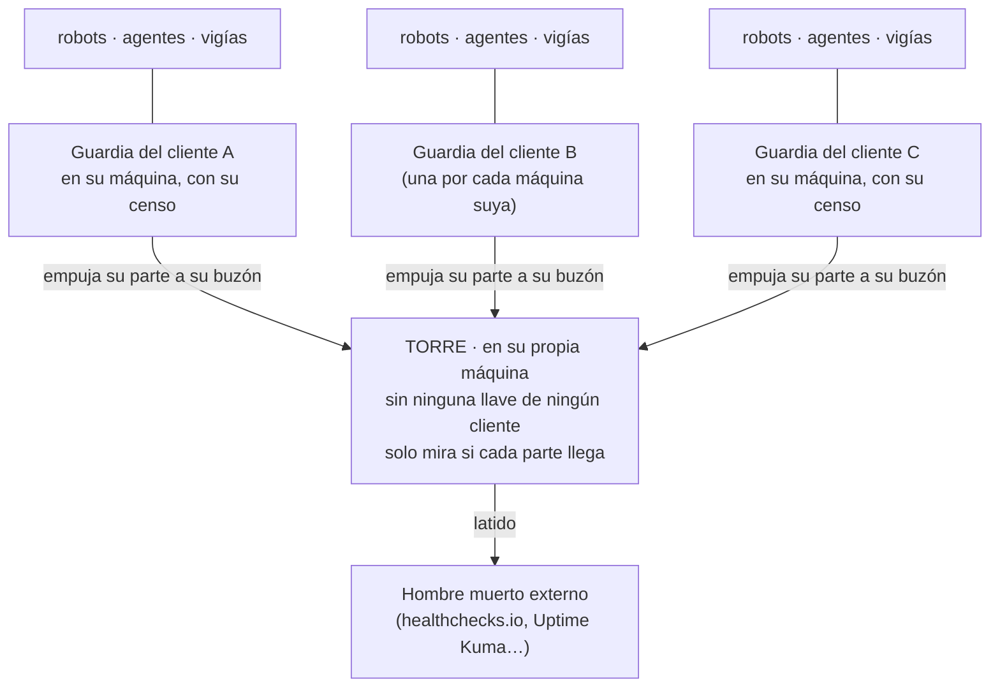

# Tus robots se mueren en silencio

**Y si vendes mantenimiento de automatizaciones a varios clientes, el último en enterarte vas a ser
tú.** Esto es una torre de control para agentes, robots y vigías: un censo de todo lo que tienes
programado, una guardia por cliente que comprueba lo que cada robot produjo (no que «corrió»), una
torre aparte que vigila a las guardias, y un candado para Claude Code que frena a tu agente cuando
aparece algo programado que nadie ha apuntado. Solo Python 3 (probado en 3.9, 3.12 y 3.14).

> **Versión 0.1.** Funciona y está probado (ver [Cómo se ha probado](#cómo-se-ha-probado)), pero es joven. Si encuentras un fallo, o una frase que no se sostiene, **abre un aviso (issue)**.

> 🇬🇧 **[English summary → README.en.md](README.en.md)**

```bash
git clone https://github.com/DEscalanteZ/tus-robots-mueren-en-silencio-es
cd tus-robots-mueren-en-silencio-es
bash demo.sh          # un minuto, datos inventados, no toca nada tuyo
```

---

## Lo que me pasó

Dirijo tres empresas y las opero con agentes de IA: robots que descargan datos, vigías, paneles,
agentes que contestan a clientes. Mi agente principal, Claude Code, los construye conmigo a
cualquier hora y en cualquier conversación.

Un verano, un robot que descargaba los datos de un proveedor **murió todas las mañanas durante siete
días**. El panel siguió enseñando los datos del primer día como si fueran del día, y nadie se enteró
hasta que alguien tiró de un hilo por casualidad.

Cuando busqué por qué, encontré cuatro fallos. **Ninguno se arreglaba con más inteligencia:**

- El vigía de ese robot existía, pero nunca se había programado. Nadie lo echó de menos, porque no
  había ninguna lista donde constara que debía estar corriendo.
- Aunque hubiera corrido, avisaba por un canal que en esa máquina no existía.
- El robot no paraba al fallar: publicaba los ficheros viejos, así que todo lo que venía detrás
  parecía fresco.
- Y la guardia que revisaba esa máquina miraba otras piezas. Ese robot no era ninguna de ellas.

Ese mismo verano aparecieron tres más de la misma familia: una copia hacia otro servidor que llevaba
**ocho días muerta**, un módulo de contabilidad que devolvió apartados vacíos durante **nueve días**
diciendo «OK», y siete tareas duplicadas que, tras una mudanza de servidor, seguían entrando dos
veces cada mañana al banco.

Ninguna de las cuatro fue un fallo de vigilancia. **Las cuatro eran piezas que nunca se dieron de
alta.** Un robot no nace vigilado: nace en una conversación cualquiera, resolviendo otra cosa,
funciona, se da por hecho y nadie vuelve a mirarlo.

Hoy mi censo tiene casi doscientas piezas de tres empresas. Con diez robots esto se lleva de cabeza.
Con doscientos, repartidos por varias máquinas y varias empresas, no lo lleva nadie.

## Dónde de verdad hace falta: cuando llevas el mantenimiento de muchos

Si montas automatizaciones y agentes para clientes y les cobras el mantenimiento, cada cliente es
una máquina más (o varias), con sus robots, sus vigías, sus llaves y su forma de romperse. El
problema deja de ser técnico y pasa a ser de inventario:

- **¿Qué tienes funcionando, exactamente, y dónde?** El censo de cada cliente es la respuesta, y
  también la lista de lo que le mantienes (lo que le cobras).
- **¿Te enteras tú antes que el cliente?** Si te enteras porque te llama, el mantenimiento ya ha
  fallado aunque el arreglo te lleve cinco minutos.
- **¿Y quién vigila a los vigías?** Con un cliente miras a mano. Con veinte, necesitas que algo te
  diga cada mañana qué guardias han hablado y cuáles no.

Por eso la estructura tiene tres pisos:



- **Una guardia por máquina de cada cliente**, con su propio censo y **con las llaves solo de lo
  suyo**. Comprueba sus robots, te avisa a ti y escribe un parte en cada pasada.
- **Una torre**, que no comprueba robots: comprueba a las guardias. **No tiene ninguna llave de
  ningún cliente**, no entra en ninguna máquina y no repara nada. Cada guardia le empuja su parte a
  su propio buzón, con una llave que solo sirve para eso, y la torre solo lleva la cuenta de quién ha
  hablado, hace cuánto, si el parte viene de quien dice y si alguna guardia dice que está a ciegas.
  Es tonta a propósito: cuanto menos piensa, menos puede equivocarse. Eso sí, se cree lo que dice
  cada parte; por eso una guardia que no ve, o que no vigila nada, lo escribe en él.
- **Un hombre muerto externo**, fuera de todas tus máquinas, que salta si la torre deja de dar señales.

## Por qué la torre no puede vivir en el mismo servidor

Es la tentación obvia: ya tienes un servidor encendido, pones la torre ahí y listo. Es el error más
caro, por cuatro motivos:

1. **Si se cae ese servidor, se caen a la vez lo vigilado y el vigilante.** Y una torre caída calla,
   igual que una torre que no tiene nada que decir: el silencio parece calma. Lo sé por mi propio
   montaje: mi torre comparte servidor con dos de mis guardias. Si cae esa máquina se van las tres a
   la vez, y lo único que lo cantaría es el latido externo, que vive fuera. Por eso el latido no es
   opcional, y por eso, si empiezas de cero, la torre va en una máquina que no vigila.
2. **Radio de daño.** Si alguien entra en la máquina de un cliente, con guardias separadas los demás
   ni se enteran. Una guardia central con las llaves de todos convierte veinte incidentes pequeños
   posibles en uno grande, y esa máquina pasa a ser la que más vale y la que más puertas tiene.
3. **Los datos de cada cliente son suyos.** Si un sistema tuyo puede leer los datos de un cliente
   desde la máquina de otro, es lo primero que te preguntará cualquier auditoría o cualquier cliente
   que se lo piense dos veces. Con guardias separadas y una torre sin llaves, ninguna máquina de un
   cliente puede leer nada de otro.
4. **Tus propios errores.** La guardia es el software con más permisos y el que corre solo. Un fallo
   suyo se queda en un cliente; un fallo de una guardia central alcanza a todos.

El parte es lo único que viaja a la torre, y va de la guardia a la torre (nunca al revés): la
máquina, la fecha, el recuento y **el nombre** de lo que está caído. El motivo de cada caída (rutas,
direcciones, la orden de una comprobación) no sale de la máquina del cliente en el parte; va solo en
el aviso que te llega a ti, así que manda los avisos a un canal privado.

## La regla

> **Todo robot, automatización, agente, vigía, servicio o panel que se cree se da de alta en el
> censo el mismo día. Lo que no está en el censo no debería estar corriendo, y lo que está en el
> censo y no corre es una alarma.**

Las dos direcciones importan. Y tres ideas que salieron de las averías:

1. **Comprobar qué produjo, nunca que corrió.** Un «OK», un código 0 o un fichero de hoy no demuestran
   nada: pueden venir vacíos, o ser el fichero de ayer publicado otra vez. Por eso la guardia
   exige un plazo y un tamaño mínimo, y puede exigir que dentro esté la fecha de hoy
   (`"contiene": "{hoy}"`) o que el contenido cambie (`"debe_cambiar": true`).
2. **El aviso que llega igual se deja de leer.** Una vez, una máquina se quedó callada cinco días;
   la guardia lo dijo catorce veces, en catorce correos idénticos, y nadie hizo nada. Aquí el aviso
   **sube de tono** (🟡 → 🟠 → 🔴) en vez de repetirse, y mientras siga caído solo recuerda una vez al día.
3. **Una comprobación que nunca ha fallado en pruebas no vale nada.** `guardia.py --revisar` busca
   las que no podrían fallar aunque quisieran: un fichero sin plazo, uno que no mira si el contenido
   es de hoy, una URL que solo mira que responda, una clave mal escrita que se ignoraría, un patrón
   de `ignorar` que lo tapa todo, una pieza «vigilada» sin comprobación o en una máquina sin guardia.
   Y aun así, a cada comprobación hay que verla fallar una vez, rompiéndola a propósito.

## Qué trae

| Pieza | Qué hace |
|---|---|
| `censo.json` | La lista de una máquina o un cliente. Cada pieza: qué hace (en una frase que entienda cualquiera), en qué máquina, su **huella** para reconocerla, su **estado** y cómo se comprueba. Ejemplos: [el de un cliente](censo.ejemplo.json) y [el de una torre con tres clientes](torre.ejemplo.json). |
| `herramientas/descubrir.py` | Mira tu crontab, `/etc/cron.d`, tus LaunchAgents (macOS), los ficheros de unidad de systemd (Linux) y, si lo pides, tus contenedores de Docker. Te dice **qué está programado sin pieza en el censo**, **qué está en el censo y ya no está programado**, **qué pieza casa con varias cosas a la vez** (una línea duplicada) y **qué ha vuelto a programarse estando APAGADO**. Mira la programación, no si funciona: eso lo dice la guardia. Con `--apuntar` añade lo que falta como `SIN VIGILAR`, con copia del censo antes. De una línea de cron solo guarda la ruta del script (o el nombre del programa y un resumen numérico), nunca la orden entera, que puede llevar contraseñas. |
| `herramientas/guardia.py` | La misma herramienta hace de guardia y de torre. Comprueba las piezas vigiladas: ficheros (con plazo, tamaño mínimo y, si quieres, el contenido esperado o la fecha escrita dentro), URLs (con el código **y** el texto esperado), contenedores (en marcha, sin estar reiniciándose en ese momento y sanos) u órdenes cualesquiera. Si una comprobación revienta por dentro, esa pieza cuenta como caída y las demás se siguen mirando. Con `--descubrir` hace también la comparación de `descubrir.py` en cada pasada. Avisa por donde le digas, deja un parte, llama a un latido externo y recuerda una vez por semana la deuda de lo que corre sin vigilar. Con `--revisar`, audita el propio censo. |
| `herramientas/candado_alta.py` | Gancho `Stop` para Claude Code. Al terminar cada respuesta mira la máquina: si aparece algo programado sin pieza en el censo (lo haya puesto el agente o no), **le frena y le pide que lo apunte** como `SIN VIGILAR` y que te proponga una comprobación. Frena una vez por sesión y por pieza; si sigue sin apuntar, se lo vuelve a pedir en la sesión siguiente. Si el candado se rompe o no puede mirar algo, no atasca al agente: te lo dice a ti. |
| `herramientas/prueba.py` | 80 comprobaciones con datos inventados. La mayoría rompen algo a propósito y miran que salta; las demás son controles (que lo sano dé verde y que no se repita lo que no debe). |
| `herramientas/roturas.py` | La prueba de la prueba: rompe el código en 25 sitios, uno cada vez, y mira que `prueba.py` deja de decir «TODO BIEN». |

### Los estados

| Estado | Qué quiere decir |
|---|---|
| `VIGILADO` | Corre y una guardia lo comprueba. |
| `SIN VIGILAR` | Corre, pero si se cae no se entera nadie. **Es deuda, no un estado normal**: la guardia la recuerda. |
| `EN OBRAS` · `PREVISTO` | Se está construyendo / decidido y sin empezar. |
| `APAGADO` | Estuvo vivo y ya no. **No se borra**: así nadie lo revive dentro de seis meses sin saber por qué se paró (y si alguien lo vuelve a programar, se avisa). |

## Ponlo en marcha

Los pasos 1 a 5 se hacen en **cada máquina** (la tuya o la de cada cliente); el 6, una sola vez, en
la máquina de la torre.

**1. Mira lo que tienes programado** (sin `--apuntar` no escribe nada). Ponle a la máquina un nombre
fijo, apúntalo en `"guardias"` y úsalo siempre con `--maquina`: el nombre del equipo puede cambiar
solo, por ejemplo al cambiar de red. Si quieres que mire también los contenedores de Docker, añade
`"contenedores": true`.

```bash
echo '{"guardias": ["cliente-a", "torre"], "ignorar": [], "piezas": []}' > censo.json
python3 herramientas/descubrir.py --censo censo.json --maquina cliente-a
```

**2. Lo que instalaron otros programas** (actualizadores, sincronizadores...) **va a la lista
`"ignorar"`**, con su etiqueta exacta o un patrón concreto: `"ignorar": ["com.google.keystone.*"]`.
**Después**, apunta lo tuyo:

```bash
python3 herramientas/descubrir.py --censo censo.json --maquina cliente-a --apuntar
```

**3. Dale a cada pieza una comprobación que falle cuando se muera**, rómpela una vez a propósito para
verla fallar, pásala a `VIGILADO` y revisa:

```bash
python3 herramientas/guardia.py --censo censo.json --revisar
python3 herramientas/guardia.py --censo censo.json --maquina cliente-a
```

**4. Prueba el canal de avisos y programa la guardia.** Los avisos llevan el motivo de cada caída
(rutas, direcciones, órdenes), así que van a un canal privado. Si usas ntfy.sh, ojo: un tema lo lee
cualquiera que sepa su nombre, así que usa un nombre largo y aleatorio (o tu propio servidor). Con
`curl`, `-f` es obligatoria (sin ella, un aviso rechazado cuenta como enviado), `https://` también, y
`--data-binary` respeta los saltos de línea del aviso.

```bash
python3 herramientas/guardia.py --censo censo.json --probar-aviso --avisar 'curl -fsS --data-binary @- https://ntfy.sh/un-nombre-largo-y-aleatorio'
```

```cron
0 * * * * python3 /ruta/herramientas/guardia.py --censo /ruta/censo.json --maquina cliente-a --descubrir --avisar 'curl -fsS --data-binary @- https://ntfy.sh/un-nombre-largo-y-aleatorio' --parte /ruta/partes/parte.txt >> /ruta/guardia.log 2>&1
5 * * * * rsync -a /ruta/partes/parte.txt torre:
```

La segunda línea empuja el parte al buzón de esta máquina en la torre. Para que esa llave **solo**
sirva para eso, en la torre se pone así en el `~/.ssh/authorized_keys` del usuario que recibe:

```text
restrict,command="rrsync -wo /srv/torre/buzon/cliente-a" ssh-ed25519 AAAA… guardia-cliente-a
```

`rrsync` es el guion de rsync para restringir llaves (según el sistema viene instalado o hay que
copiarlo de la documentación de rsync). Con `-wo`, esa llave solo puede escribir en su buzón: ni leer,
ni salir de él, ni abrir una terminal. Probado: un intento de escribir en el buzón de otro cliente o de
leer el parte se rechaza.

Apunta la guardia y el envío del parte en el censo de esta máquina como `VIGILADO` con
`"vigila_desde": "torre"` (por eso `"torre"` va en `"guardias"`): los vigila la torre, mirando que
el parte llegue. Mira cómo en [`censo.ejemplo.json`](censo.ejemplo.json).

**5. Pon el candado a tu Claude Code** (en las máquinas donde trabaje tu agente), en
`~/.claude/settings.json`, dentro de `"hooks"`:

```json
"Stop": [{"hooks": [{"type": "command",
  "command": "python3 /ruta/herramientas/candado_alta.py --censo /ruta/censo.json --maquina cliente-a || echo '{\"systemMessage\": \"⚠️ El candado de alta no arranca\"}'"}]}]
```

El `|| echo` es a propósito: si el candado no puede ni arrancar (has movido la carpeta, no hay
`python3`), tu agente sigue trabajando y a ti te sale ese aviso en vez de nada.

**6. La torre, en su propia máquina.** Su censo ([`torre.ejemplo.json`](torre.ejemplo.json)) tiene
una pieza por cada guardia, es decir, por cada máquina de cada cliente, y `"buzon"` con la carpeta
de los buzones. Cada pieza mira el parte de su buzón con:

- `"edad_por_contenido": true`: la edad sale de la fecha escrita dentro del parte, no de la del
  fichero. Así no engaña una copia que pone la fecha de «ahora», y vale aunque las máquinas estén en
  zonas horarias distintas.
- `"contiene": "guardia de «cliente-a»"`: el parte tiene que venir de esa máquina y no de otra.
- `"no_contiene": "A CIEGAS"`: una guardia que no puede avisar, o que no vigila nada, lo dice ahí.

**Cada máquina nueva, una pieza nueva en la torre.** Y si se te olvida, salta igual: si llega un
parte a un buzón que ninguna pieza mira, la torre lo avisa. La torre se programa como una guardia
más, con `--latido` hacia el hombre muerto externo. Configura el hombre muerto con un periodo parecido
al de la torre (no el de un día que algunos traen por defecto) y que te avise **por otro canal** que
no sea el de `--avisar`: si ese canal cae, que no se caiga todo con él.

```cron
*/30 * * * * python3 /ruta/herramientas/guardia.py --censo /ruta/torre.json --maquina torre --avisar 'curl -fsS --data-binary @- https://ntfy.sh/un-nombre-largo-y-aleatorio' --latido https://tu-servicio-de-latido/... >> /ruta/torre.log 2>&1
```

**O pídeselo a tu propio Claude Code**, pegándole esto (una vez por máquina):

> Lee el README de este repositorio. Ejecuta `descubrir.py` sobre un censo vacío y enséñame lo que
> hay programado en esta máquina. Ayúdame a separar lo mío de lo que instalaron otros programas (eso
> va a «ignorar», con su etiqueta exacta) y solo después apunta lo mío con `--apuntar` y un `--maquina`
> fijo. Para cada pieza, propónme qué hace y una comprobación que falle si se muere o si publica datos
> viejos: dime de dónde sacas cada cosa y pregúntame lo que no sepas. No pongas nada como VIGILADO sin
> una comprobación que hayamos visto fallar. Después, ayúdame a montar el canal de avisos, pruébalo
> con `--probar-aviso` hasta que me llegue de verdad, y programa la guardia. Al final, instala el
> candado en mis ganchos sin tocar los que ya tenga y pasa `guardia.py --revisar`. Si tengo una torre,
> dime qué pieza tengo que añadirle y qué línea de `authorized_keys`.

La torre necesita una máquina aparte y algo de ssh: si es tu primera vez, hazlo con calma y con tu
agente al lado.

## Una guardia a ciegas no se hace la sana

El fallo que más cuesta ver: **la guardia también se muere**, y cuando se muere, calla. Calla igual
que cuando todo va bien. Por eso:

- **El parte que no llega es una alarma, no un hueco.** Si una guardia deja de mandar su parte, su
  fecha envejece y la torre grita.
- **Si una guardia no puede avisar** (o no tiene `--avisar` y está en marcha con parte o latido) o no
  puede guardar su memoria, sale con 3, **escribe «A CIEGAS» en el parte y deja de dar el latido**:
  así saltan la torre y el hombre muerto. El aviso que no salió se vuelve a intentar en la pasada
  siguiente. Si lo que no puede es escribir el parte, tampoco puede escribir eso en él: el parte
  envejece y la torre salta igual.
- **Una guardia que no vigila nada tampoco da verde.** Si su `--maquina` no está en `"guardias"`, o a
  esa máquina no le toca ninguna pieza `VIGILADO` (por ejemplo, justo después de `--apuntar`, con todo
  `SIN VIGILAR`), lo dice, escribe «A CIEGAS» en el parte y sale con 3.
- **Y a la torre la vigila alguien de fuera**: el hombre muerto externo, el único que no vive en
  ninguna de tus máquinas.

## Cómo se ha probado

- `herramientas/prueba.py`: 80 comprobaciones con datos inventados, en una carpeta temporal. Pasan
  en Python 3.9, 3.12 y 3.14. Docker se simula con un programa `docker` de mentira.
- `herramientas/roturas.py`: rompe el código en 25 sitios (dar el latido estando a ciegas, dejar que
  una comprobación tumbe la guardia, no ver las líneas duplicadas, copiar la orden de cron con sus
  secretos, ignorar la zona horaria del parte, sacar en el parte los motivos de cada caída, no ver
  un buzón sin pieza en la torre...). La prueba caza las 25.
- `demo.sh` monta una torre con clientes inventados: uno sano, uno cuya guardia lleva siete horas
  callada, uno cuya guardia está a ciegas y uno nuevo que manda partes sin que nadie lo haya apuntado
  en la torre. La torre da verde al primero y rojo a los otros tres.
- La llave restringida del rsync, con `rrsync -wo` en una prueba simulada: el parte llega a su
  buzón, y escribir en el de otro cliente o leer el parte se rechaza.
- `descubrir.py` sobre un Mac real con un censo vacío: encontró los 30 LaunchAgents activos del
  usuario en menos de 0,2 segundos, sin escribir nada.
- El candado, dentro de un Claude Code de verdad en modo no interactivo, dos veces: se le pidió
  añadir una línea a un crontab de prueba «y nada más». Las dos veces el candado le frenó. En la
  primera, el agente apuntó la pieza en el censo como `SIN VIGILAR`, sin inventarle una comprobación
  (el script no existía), y pasó la revisión. En la segunda, se atuvo al «nada más»: no tocó el censo,
  pero avisó de que el robot quedaba sin vigilar y pidió lo que necesitaba para apuntarlo. Y con el
  censo mal escrito a propósito, el aviso de «candado roto» le llegó al usuario como mensaje del
  sistema.
- Antes de publicarlo, **dos rondas de dos revisores en frío** intentaron tumbarlo, y **las dos
  encontraron fallos de peso**: una guardia a ciegas que seguía dando el latido, un `--maquina` mal
  puesto que daba todo en verde, la línea de cron duplicada (justo la avería del banco) que pasaba sin
  aviso, contraseñas de la línea de cron que acababan en el censo, una torre en otra zona horaria que
  daba falsas alarmas, un `"ignorar"` mal escrito que lo tapaba todo, y frases de este README que
  prometían de más. Después, otra pareja de revisores miró solo el texto nuevo sobre la torre y
  encontró 8 más: el parte que viaja a la torre llevaba el motivo de cada caída (y con él rutas,
  direcciones y órdenes), un cliente nuevo podía quedar sin vigilar, la llave del rsync no se
  explicaba cómo restringirla y el ejemplo de avisos iba por un canal público y sin cifrar. Todo
  arreglado, cada arreglo con su caso en la prueba. **Cada ronda ha encontrado algo**: el bucle no se
  ha secado, así que es probable que queden fallos. Si encuentras uno, abre un aviso.

**Límites conocidos (v0.1):**

- `descubrir.py` y el candado ven lo que se programa en **esa** máquina con cron, launchd, systemd y
  Docker. No ven pm2, supervisord, procesos lanzados a mano (`nohup`, tmux) ni `launchctl submit`; lo
  que tu agente programe por ssh en otra máquina tampoco lo ve el candado (para eso, una guardia con
  `--descubrir` en cada máquina). Las automatizaciones en la nube (n8n, Make, tareas de un proveedor)
  se apuntan a mano, sin huella, y se vigilan por lo que producen.
- Mira la **programación**, no si está activa: un plist que no se cargó, una unidad de systemd
  deshabilitada o un fichero de `/etc/cron.d` que tu cron ignora cuentan como programados. En Linux
  mira los ficheros de unidad de `/etc/systemd/system/` (algunos paquetes, como snap, también
  escriben ahí) y de tu usuario, pero no `/etc/crontab`, `cron.daily`/`cron.hourly` ni los crontabs de
  otros usuarios. En macOS, solo tus LaunchAgents, salvo que el censo diga `"launchd_sistema": true`.
- Un contenedor que se cae y se levanta cada pocos minutos puede salir «en marcha» si se le mira en
  el momento bueno. Para eso, una comprobación de lo que produce.
- Las fuentes de Linux (systemd, `/etc/cron.d`) y Docker se han probado con datos simulados, no en
  un Linux con Docker de verdad. Si ejecutas la prueba como root, se saltan los dos casos de
  permisos (a root no le frenan).
- **El censo es código.** Una comprobación `orden` ejecuta lo que ponga ahí, con los permisos de
  quien corre la guardia, cada vez que corre. Trata el censo como un script: que solo lo pueda editar
  quien podría editar tus scripts, y mira las órdenes nuevas antes de aceptarlas (`--revisar` las
  enseña todas).
- Es una versión generalizada del sistema que uso, y lleva solo la parte que vigila: lo que tengo
  encima (un panel, el mapa de qué arrastra cada pieza al caer, un agente que resume los avisos) no
  está aquí. Mi sistema lleva meses en marcha, pero **este código** está probado con lo de arriba, no
  con meses de uso.

---

## Relacionado

- **[Bitácora de averías](https://github.com/DEscalanteZ/bitacora-de-averias-es)**: las tres familias de fallos en las que cae un sistema con agentes. Este repositorio nace de la segunda: la pieza fuera de lista.
- **[Seis patrones para trabajar con agentes de IA](https://github.com/DEscalanteZ/ai-agent-patterns-es)**: incluye los refutadores en frío, que revisaron este repositorio antes de publicarlo.
- **[Comunicación entre dos Claude Code](https://github.com/DEscalanteZ/comunicacion-entre-dos-claude-code-es)**: ganchos de arranque y de cierre aplicados a un buzón entre dos agentes.
- **[Voz para Claude Code](https://github.com/DEscalanteZ/voz-para-claude-code-es)**: hablarle a Claude Code y que conteste en voz alta, en local.

---

¿Has encontrado un fallo o algo que no se sostiene? **Abre un aviso (issue)**: esto es una versión 0.1.

⭐ **Si te ha servido, dale una estrella al repositorio**: es la forma más sencilla de que le llegue a más gente que trabaja con agentes en español.

*Autor: David Escalante ([@DEscalanteZ](https://github.com/DEscalanteZ)). El código (`herramientas/`, `demo.sh`) y los censos de ejemplo (`censo.ejemplo.json`, `torre.ejemplo.json`) son [MIT](LICENSE): cópialos y úsalos como quieras. Los textos están bajo [CC BY 4.0](LICENSE-TEXTOS): puedes copiarlos y adaptarlos citando la fuente.*
